# Verdict — High Level Design

**Accelerate 3.0 · Smart Escrow Network · Transaction Banking**
**Version:** 2 · **Date:** 2026-09-16 · **Owner:** Pratik Kumar
**Reads with:** [Glossary](01-glossary-v2.md) · [Scenarios](04-scenarios.md) · [ADR-001](adr/0001-three-plane-separation.md)

---

## 1. The problem

Escrow's cost is not holding money. It is resolving the cases where the evidence does not match the
terms.

The ICC's own figures put refusal of documentary presentations on first submission at **60–80%**,
a rate that did not improve when UCP 600 replaced UCP 500 in 2007. Every refusal becomes an ops
analyst, an email chain, and an amendment fee. Standard escrow fee schedules price this openly:
a setup fee, an annual administration fee, a per-amendment fee, and separately negotiated
"extraordinary" fees for anything non-routine.

Most conditional-payment systems, including our own pre-hackathon build, automate the compliant
case. That is the minority of presentations.

**Verdict automates the disagreement.** It examines evidence against contract conditions, and
returns one of four determinations — release, partial release, hold pending approval, or hold —
with an itemised findings notice and a replayable record of why.

---

## 2. Scope of this document

| In | Out (belongs to the LLD) |
|---|---|
| Container structure, the three planes, component responsibilities, domain model, node/graph contract, **user flows**, **high-level API surface**, lifecycle, NFRs, deployment, scope split | Database DDL, wire-level API schemas, the rule DSL grammar, index and partition strategy, message formats (pacs.008 field mapping) |

"High-level API surface" means the resources, the state-changing operations, the determination as the
response contract, and the cross-cutting rules (idempotency, auth, errors). Field-level schemas are
LLD.

---

## 3. Context — who touches the system

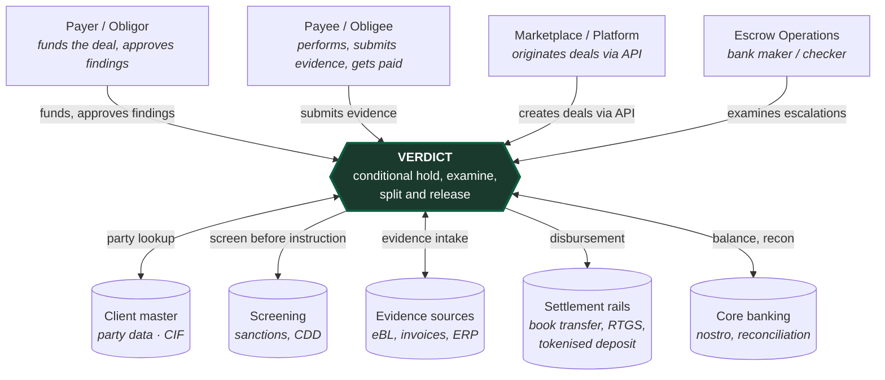

Three external systems are **mocked behind real ports** for the hackathon — screening, evidence
extraction, and the settlement rail. Each is one named implementation to write; the call sites are
real (§5, §11).

---

## 4. Container view — the three planes

Per [ADR-001](adr/0001-three-plane-separation.md), the system is separated into three planes that
answer three different questions. The determination is the **only** contract from decision to money,
and it is one-directional — nothing crosses back.

| Plane | Answers | Owns | Layers | Java packages | Mutability |
|---|---|---|---|---|---|
| **Decision** | What *should* happen | Authority, contract, obligations, conditions, findings, determinations, entitlements | L0, L1, L2, L4, L5 | `party`, `contract`, `examination`, `casework`, `entitlement` | Versioned; new versions, never edits |
| **Money** | What *did* happen | Held balance, earmarks, postings, disbursements, **settlement** | L6, L7 | `ledger`, (settlement adapter) | Append-only postings; corrections reverse |
| **Evidence** | *Why* it happened | Documents, extracted facts, approvals, decision journal | L3, L8 | `evidence`, `journal` | Append-only, never mutated |

> Note on your mental model: **settlement is inside Money; obligations are inside Decision.** The
> planes are drawn one level above those pieces.

**4.1 Structure — the planes and the one contract between them.** Each plane is one solid box (with
its layers listed inside); the determination — the thick arrow — is the only thing that crosses from
decision to money. Colours and text are set explicitly so the diagram reads the same in a light or a
dark viewer.

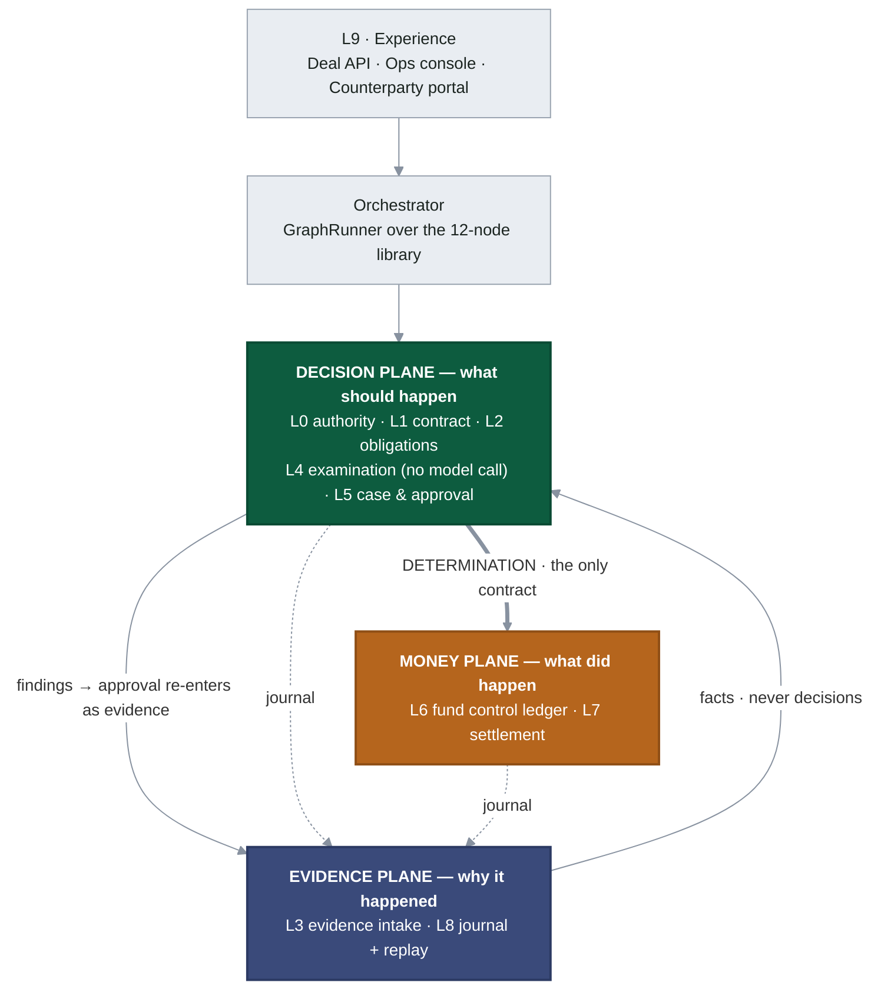

Layers are enumerated per plane in §5. Three components are mocked, each **behind a real port** so
exactly one file changes to go live: the **screening** adapter (called by L0 on every instruction),
the **extraction** adapter (L3), and the **settlement** rail (L7). The call sites are real.

**4.2 The reconciliation control (ADR-005).** Kept as its own view deliberately: its two inputs come
from *different planes* and are computed independently, which is the entire point — if they ever
disagree, that is the alarm.

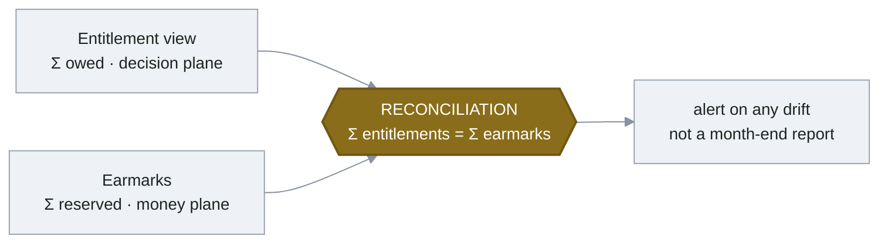

**The two boundaries that define the system:**

1. **L3 → L4 (ADR-002).** Extraction adapters assert facts with confidence. They never decide. The
   examination engine contains no model call.
2. **L4 → L6 (ADR-001).** The decision plane emits a determination. It never writes a posting. The
   money plane has no opinion on whether a release is correct, and never reads an obligation.

Both boundaries are enforced by an **architecture test** that fails the build on a forbidden import
(`ArchitectureRules`, §5) — not by convention.

---

## 5. Component responsibilities

Every layer, its plane, the package that holds it, what it is for the hackathon, and the import rule
that keeps the planes apart.

| Layer | Plane | Package | Build | Must **not** import |
|---|---|---|---|---|
| **L0** Party & Authority | Decision | `party` | Built · 12 scenarios | money, examination, contract, evidence |
| L0 Screening | — (adapter) | `party` (`ScreeningPolicy` port) | **Mocked** · call site real | — |
| **L1** Contract Registry | Decision | `contract` | Built, thin | anything but `shared` |
| **L2** Obligation Model | Decision | `contract` | Built | anything but `shared` |
| L2 Contract→obligation extraction | — (adapter) | (LLM over fixed corpus) | **Mocked** · hand-authorable | — |
| **L3** Evidence Intake | Evidence | `evidence` | Built over fixed corpus | money plane |
| L3 Extraction | — (adapter) | `ExtractionAdapter` port | **Fixture + live LLM** · Spring AI, runtime toggle | — |
| **L4** Examination Engine | Decision | `examination` | **Built · the core** | money plane, extraction adapter |
| **L5** Case & Approval | Decision | `casework` | Built, thin | money plane |
| **L6** Fund Control Ledger | Money | `ledger` | **Built · never mocked** | obligation, condition, finding |
| L6 Reconciliation control | control | `entitlement` + `recon` | Built | — (spans both, by design) |
| **L7** Settlement | Money | (`SettlementRail` port) | **Mocked** · pacs.008 emit | obligation, condition, finding |
| **L8** Decision Journal + Replay | Evidence | `journal` | Built | money plane |
| **Orchestrator** graph runtime | — | `orchestrator` | Built, thin | — |
| **L9** Experience | — | (Spring shell, web) | Building (phase 2) | domain internals |

The determination contract is the record that crosses L4 → L6: it carries the outcome, the per-payee
disbursement lines, the residual lines, and the pinned versions — and nothing that would let the
money plane form an opinion (no findings, no conditions).

**Where the AI is (and where it is not).** AI does the *reading*, never the deciding (ADR-002). The
live extraction adapter (`LlmExtractionAdapter`, Spring AI over a provider-agnostic `ChatModel`)
turns documents into `ExtractedFact`s with a confidence per field; it sits behind the same
`ExtractionAdapter` port as the fixture, so the examination engine cannot tell a live extraction from
a canned one — and `ArchitectureRules` fails the build if the engine imports the adapter at all. The
backend model is adopted "as per availability" by swapping the Spring AI starter; ops flip
fixture ↔ live at runtime with a button, defaulting to fixture so the four-pack demo stays
deterministic. This is the bank-credible AI posture: *the model reads, the engine decides, and the
separation is a build-enforced control, not a promise.*

---

## 6. Domain model

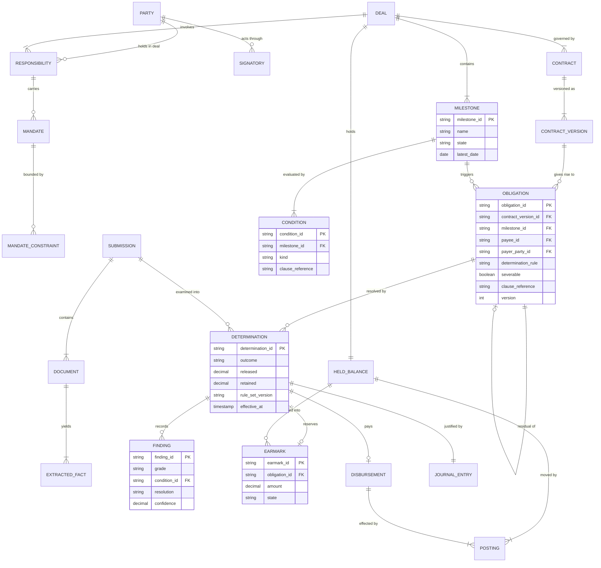

**The distinction that carries the product:** a **milestone** is a trigger; an **obligation** is an
entitlement. One milestone discharges several obligations — 60% to the supplier, a marketplace
commission, a bank fee. Systems that collapse the two cannot express multi-payee splits, fee
deduction, or partial release cleanly.

---

## 7. The orchestrator — nodes and graphs

The orchestrator is a first-class container, not glue. Nodes are **code**: reviewed, versioned,
tested once. Graphs are **configuration**. **"Different graph, same nodes" is meant literally** — a
new deal type adds a `GraphDefinition` and a rule set, never a node (ADR-004).

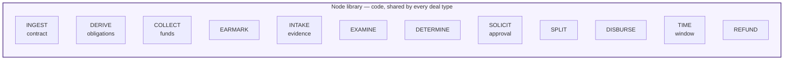

```mermaid
flowchart TB
    subgraph g1["Marketplace trade — hero case"]
        direction LR
        a1["COLLECT"] --> a2["EARMARK"] --> a3["INTAKE"] --> a4["EXAMINE"] --> a5["DETERMINE"] --> a6["SPLIT"] --> a7["DISBURSE"]
        a5 -.->|"findings"| a8["SOLICIT<br/>approval"]
        a8 -.->|"approval as evidence"| a4
    end
    subgraph g2["M&amp;A holdback"]
        direction LR
        b1["COLLECT"] --> b2["TIME"] --> b3["INTAKE"] --> b4["EXAMINE"] --> b5["DETERMINE"] --> b6["SPLIT"] --> b7["DISBURSE"]
    end
    subgraph g3["Construction retention"]
        direction LR
        c1["COLLECT"] --> c2["INTAKE"] --> c3["EXAMINE"] --> c4["DETERMINE"] --> c5["EARMARK"] --> c6["TIME"] --> c7["DISBURSE"]
    end
    subgraph g4["Conditional payout"]
        direction LR
        d1["COLLECT"] --> d2["INTAKE"] --> d3["EXAMINE"] --> d4["DETERMINE"] --> d5["DISBURSE"]
    end
    style g1 fill:#e8f0ec,stroke:#0d5c3f,stroke-width:3px
    style g2 fill:#f7f7f7,stroke:#999
    style g3 fill:#f7f7f7,stroke:#999
    style g4 fill:#f7f7f7,stroke:#999
```

Four deal types. One node library. No new code. In the codebase this is literally
`orchestrator/Graphs.java` (four `GraphDefinition`s over the same `Node` enum) driven by
`GraphRunner`.

### Node contract

Every node satisfies the same interface, which is what makes composition safe:

| Element | Rule |
|---|---|
| Input | Immutable deal context as of an instant |
| Output | Zero or more domain events; never direct state mutation |
| Authority | Any state-changing node presents an instruction to L0 admission first |
| Idempotency | Keyed on (deal, node, correlation key); re-execution is a no-op |
| Journal | Emits exactly one journal entry per execution |
| Determinism | Given the same input and rule-set version, produces the same output |

---

## 8. User flows

### Actors

| Actor | May do | May not |
|---|---|---|
| **Payer / Obligor** (buyer) | Fund the deal; approve findings | Instruct release to itself |
| **Payee / Obligee** (supplier) | Submit evidence; receive disbursement | Approve its own findings |
| **Escrow Operations** (bank maker/checker) | Examine escalations; operate agent instructions under four-eyes | Bypass the admission gate |
| **Marketplace operator** | Create deals via API; observe | **Instruct anything** (observer role) |
| **Verdict** (system/agent) | Examine, determine, split, disburse under admitted instructions | Decide with a model; write a posting from the decision plane |

### Flow A — deal creation and funding

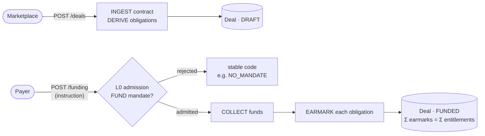

### Flow B — evidence to determination (the decision)

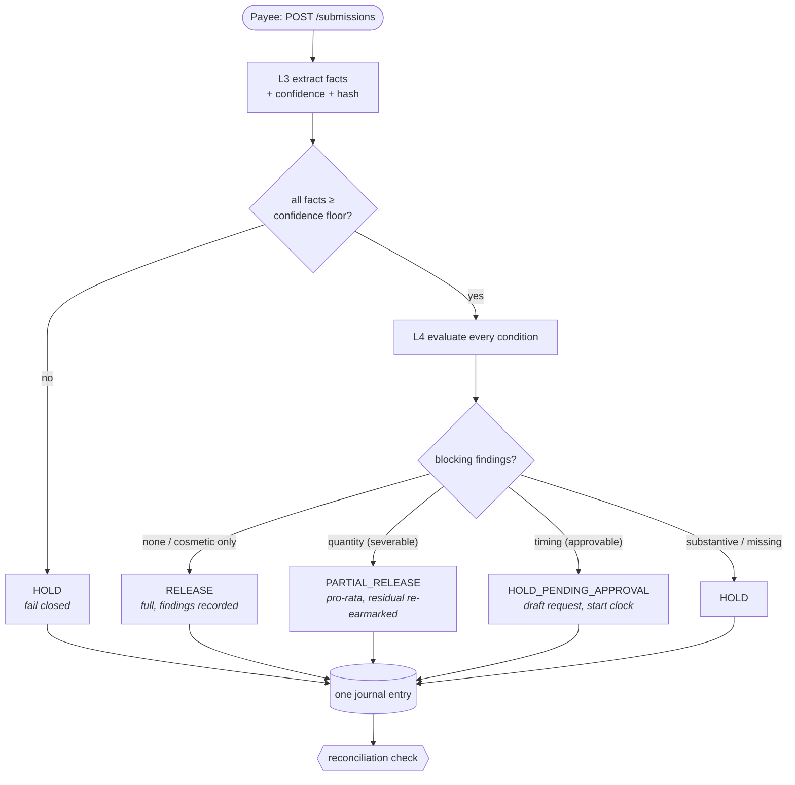

Every path writes exactly one journal entry and is followed by the reconciliation check — including
the holds, which move nothing.

### Flow C — short shipment → partial release (hero beat)

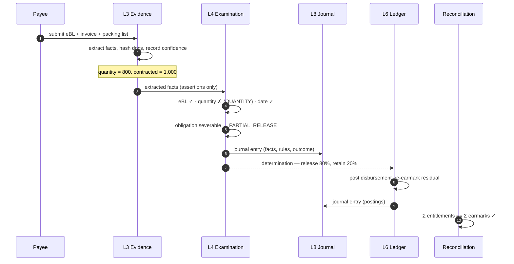

### Flow D — late shipment → approval → release (four-eyes)

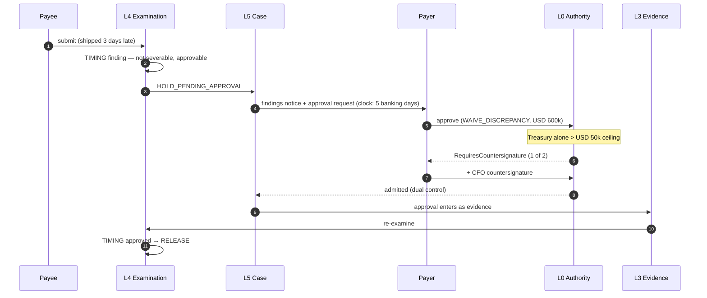

---

## 9. API surface — high level

REST/JSON over HTTPS. Every state-changing call is an **instruction** and passes
`AuthorityPolicy.admit()` before any other layer acts; there is no unauthenticated path to state.

### Resources and operations

| Method & path | Actor | Effect | Success |
|---|---|---|---|
| `POST /deals` | Marketplace | Ingest contract, derive obligations (deal `DRAFT`) | `201` deal |
| `GET /deals/{id}` | Any party | Cross-plane read model: obligations + balances + status | `200` |
| `POST /deals/{id}/funding` | Payer | Fund; `FUND` instruction → collect + earmark | `202` / `200` |
| `POST /deals/{id}/submissions` | Payee | Submit evidence → extract → examine → **determination** | `201` determination |
| `GET /deals/{id}/determinations/{detId}` | Any party | Determination + itemised findings notice | `200` |
| `POST /deals/{id}/determinations/{detId}/approvals` | Payer | Approve findings; `WAIVE_DISCREPANCY` instruction → re-examine | `200` / `409` needs countersignature |
| `GET /deals/{id}/ledger` | Payer, Ops | Held balance, earmarks, disbursements, reconciliation status | `200` |
| `GET /deals/{id}/journal` | Ops, Audit | Append-only journal entries | `200` |
| `POST /deals/{id}/determinations/{detId}/replay` | Ops, Audit | Re-run examination from the journal; assert identical | `200` replay result |

### The response contract

`POST /submissions` and `/approvals` both return a **determination**: `outcome` ∈
{`RELEASE`, `PARTIAL_RELEASE`, `HOLD_PENDING_APPROVAL`, `HOLD`}, the per-payee `disbursements`, any
`residuals`, the `findings` (grade, resolution, clause, confidence), and the pinned
`ruleSetVersion` / `effectiveAt`. This is the same object the money plane consumes internally — the
API exposes the contract, it does not invent a second one.

### Cross-cutting

| Concern | Rule |
|---|---|
| **Idempotency** | `Idempotency-Key` header = instruction id; carried through ledger and settlement. Re-delivery moves nothing twice. |
| **Authorisation** | Marketplace: OAuth2 client-credentials / mTLS. Operators: SSO. Every write maps to an `Instruction`; admission decides. |
| **Errors** | `application/problem+json` with stable codes — the L0 admission codes (`AUT-001…011`) and ledger/examination codes are part of the contract and are not renumbered. |
| **Determinism** | `effectiveAt` may be supplied on write for back-dated resolution; absent, the service stamps it and pins it. Decision logic never reads a clock. |
| **Fail-closed** | Screening `PENDING`, or extraction below the confidence floor, refuses rather than releases. |

Detailed request/response schemas and the rule DSL are LLD.

---

## 10. Obligation lifecycle

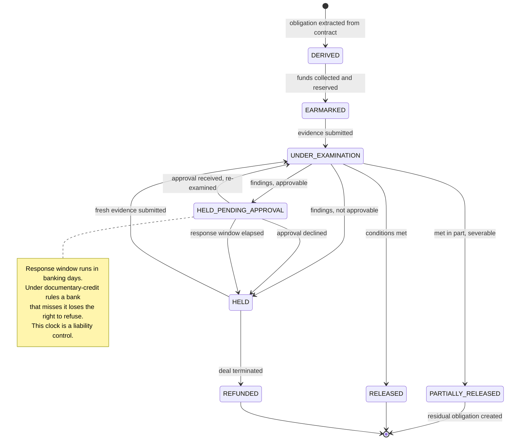

---

## 11. Scope — build, mock, defer

Everything mocked is an **adapter behind a port**, so the file that changes to go live is nameable.

| Layer | Hackathon | Why |
|---|---|---|
| **L0 Party & Authority** | **Built** | Mandates, quorum, four-eyes, admission gate. 12 scenarios. |
| L0 Screening | **Mocked** | `ScreeningPolicy` port; called on every instruction; canned result. |
| **L1 Contract Registry** | **Built, thin** | Versioning and clause references only. |
| **L2 Obligation Model** | **Built** | The primitive. Multi-payee splits, severability. |
| L2 Contract→obligation extraction | **Mocked** | LLM over a fixed corpus; obligations also hand-authorable. |
| **L3 Evidence Intake** | **Built** over fixed corpus | `ExtractionAdapter` port; real hashes; pre-baked confidences for demo determinism. |
| **L4 Examination Engine** | **Built · the core** | Four determinations, five finding grades, findings notice, no model call. |
| **L5 Case & Approval** | **Built, thin** | Escalation, approval solicitation, banking-day clock. |
| **L6 Fund Control Ledger** | **Built** | Double-entry, earmarks, invariants. Never mocked. |
| **L6 Reconciliation control** | **Built** | Σ entitlements = Σ earmarks. Justifies ADR-001. |
| **L7 Settlement** | **Mocked** | Emits a well-formed pacs.008 and logs it. Rail port is real. |
| **L8 Decision Journal + Replay** | **Built** | Append-only with a working replay. |
| **Orchestrator graph runtime** | **Built, thin** | Runs the marketplace graph; three others as configuration. |
| **L9 Experience** | **Building (phase 2)** | One ops console, one counterparty view. Two screens. |
| Multi-currency FX | **Deferred** | Single deal currency. |
| Mandate constraint framework | **Deferred** | Amount ceiling and currency scope only. |
| Physical plane separation | **Deferred** | Logical separation by module. ADR-001 option D stays open. |

**Priority order if time runs short:** four determinations → ledger/earmarks/reconciliation → replay
→ graph runtime. (All met; see [scenarios](04-scenarios.md), 43 executable expectations.)

---

## 12. Non-functional requirements

| Property | Target | How |
|---|---|---|
| **Replay determinism** | Any determination reproduces its identical outcome indefinitely | No clock reads in decision logic; effective instant supplied; rule-set and adapter versions pinned in the journal |
| **Idempotency** | Re-delivery causes no duplicate movement | Instruction id as idempotency key through ledger and settlement |
| **Auditability** | Every movement traceable to evidence, rule and actor | One journal entry per determination and posting, in the same transaction |
| **Ledger integrity** | No negative balance, no over-earmark | Ring-fenced accounts refuse to go negative; postings never amended |
| **Authority** | No instruction without a resolvable mandate | Single admission gate; no internal bypass path |
| **Fail-closed** | Unevaluable control refuses | Screening PENDING refuses; indeterminate condition does not release |
| **Plane isolation** | Boundaries cannot erode silently | Architecture test fails the build on a forbidden import |

---

## 13. Deployment

Single Spring Boot service, single Postgres. Plane separation is enforced by **module boundaries and
package structure**, not network hops — deliberately, per ADR-001 (option D remains available without
redesign). Runs locally with `docker compose up`.

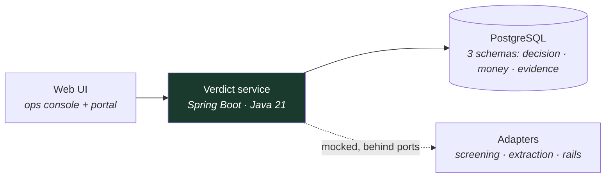

The domain core (`party`, `contract`, `examination`, `ledger`, `entitlement`, `recon`, `journal`,
`casework`, `orchestrator`) is **plain Java with no framework imports** and runs without Spring —
verified by `scripts/run-verify.sh`. Controllers, persistence and config are a thin shell around it.

---

## 14. Why this converts to a pilot

- Every mocked component is a **named port with one implementation to write** — screening, rails,
  extraction. The integration estimate is a file list, not a discovery phase.
- The vocabulary is neutral, so the same engine serves escrow, trade finance and conditional payouts
  without re-platforming. Legal characterisation stays with each deal's governing contract.
- Settlement rails are pluggable, including tokenised deposit — digital-asset settlement is an
  adapter here, not a competing architecture.
- The reconciliation control and the decision journal are the two things Risk asks for first, and
  both are built rather than promised.
