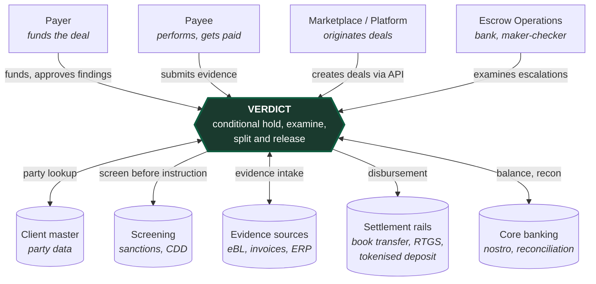
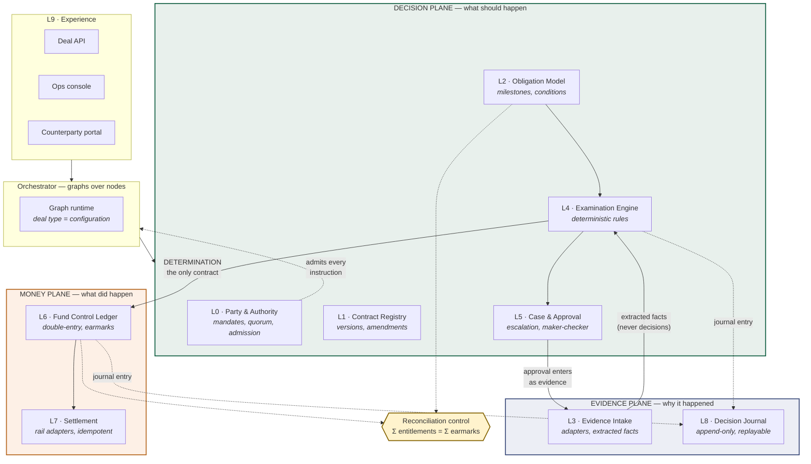
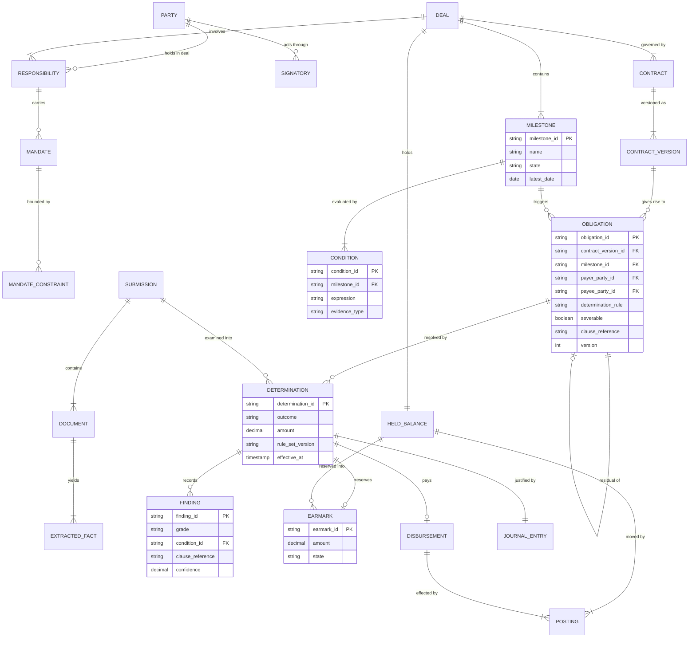
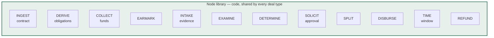
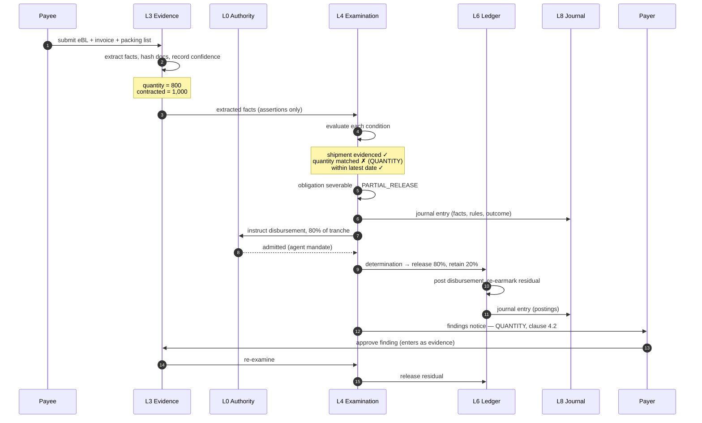
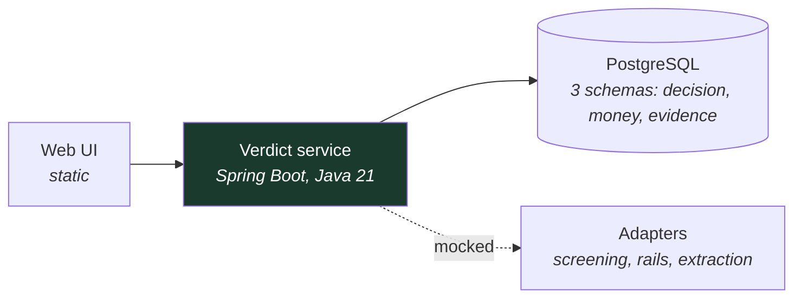

# Verdict — High Level Design

**Accelerate 3.0 · Smart Escrow Network · Transaction Banking**
**Version:** 1 · **Date:** 2026-09-15 · **Owner:** Pratik Kumar
**Reads with:** [Glossary](01-glossary-v2.md) · [ADR-001](adr/0001-three-plane-separation.md)

---

## 1. The problem

Escrow's cost is not holding money. It is resolving the cases where the evidence does not match the
terms.

The ICC's own figures put refusal of documentary presentations on first submission at **60–80%**,
a rate that did not improve when UCP 600 replaced UCP 500 in 2007. Every refusal becomes an ops
analyst, an email chain, and an amendment fee. Standard escrow fee schedules price this openly:
a setup fee, an annual administration fee, a per-amendment fee, and separately negotiated
"extraordinary" fees for anything non-routine.

Most conditional-payment systems, including our own pre-hackathon build, automate the compliant
case. That is the minority of presentations.

**Verdict automates the disagreement.** It examines evidence against contract conditions, and
returns one of four determinations — release, partial release, hold pending approval, or hold —
with an itemised findings notice and a replayable record of why.

---

## 2. Scope of this document

| In | Out |
|---|---|
| Container structure, domain model, node/graph contract, lifecycle, NFRs, scope split | Database DDL, API schemas, rule DSL grammar — see LLD |

---

## 3. Context

---

## 4. Container view — the three planes

Per [ADR-001](adr/0001-three-plane-separation.md), the system separates what *should* happen, what
*did* happen, and *why*. The determination is the only contract between the first two.

**The two boundaries that define the system:**

1. **L3 → L4.** Extraction adapters assert facts with confidence. They never decide. The examination
   engine contains no model call.
2. **L4 → L6.** The decision plane emits a determination. It never writes a posting. The money plane
   has no opinion on whether a release is correct.

---

## 5. Domain model

**The distinction that carries the product:** a **milestone** is a trigger; an **obligation** is an
entitlement. One milestone discharges several obligations — 60% to the supplier, 2% commission to
the marketplace, a fee to the bank. Systems that collapse the two cannot express multi-payee splits,
fee deduction, or partial release cleanly.

---

## 6. Nodes and graphs — the platform claim

Nodes are code: reviewed, versioned, tested. Graphs are configuration. **"Different graph, same
nodes" must remain literally true**, or the platform claim is marketing.

```mermaid
flowchart TB
    subgraph g1["Marketplace trade — hero case"]
        direction LR
        a1["COLLECT"] --> a2["EARMARK"] --> a3["INTAKE"] --> a4["EXAMINE"] --> a5["DETERMINE"] --> a6["SPLIT"] --> a7["DISBURSE"]
        a5 -.->|"findings"| a8["SOLICIT<br/>approval"]
        a8 -.-> a4
    end

    subgraph g2["M&amp;A holdback"]
        direction LR
        b1["COLLECT"] --> b2["TIME<br/>window"] --> b3["INTAKE<br/><i>claim</i>"] --> b4["EXAMINE"] --> b5["DETERMINE"] --> b6["SPLIT"] --> b7["DISBURSE"]
    end

    subgraph g3["Construction retention"]
        direction LR
        c1["COLLECT"] --> c2["INTAKE<br/><i>certificate</i>"] --> c3["EXAMINE"] --> c4["DETERMINE"] --> c5["EARMARK<br/><i>retention</i>"] --> c6["TIME<br/>window"] --> c7["DISBURSE"]
    end

    subgraph g4["Conditional payout"]
        direction LR
        d1["COLLECT"] --> d2["INTAKE<br/><i>event</i>"] --> d3["EXAMINE"] --> d4["DETERMINE"] --> d5["DISBURSE"]
    end

    style g1 fill:#e8f0ec,stroke:#0d5c3f,stroke-width:3px
    style g2 fill:#f7f7f7,stroke:#999
    style g3 fill:#f7f7f7,stroke:#999
    style g4 fill:#f7f7f7,stroke:#999
```

Four deal types. One node library. No new code.

### Node contract

Every node satisfies the same interface, which is what makes composition safe:

| Element | Rule |
|---|---|
| Input | Immutable deal context as of an instant |
| Output | Zero or more domain events; never direct state mutation |
| Authority | Any state-changing node presents an instruction to L0 admission first |
| Idempotency | Keyed on (deal, node, correlation key); re-execution is a no-op |
| Journal | Emits exactly one journal entry per execution |
| Determinism | Given the same input and rule-set version, produces the same output |

---

## 7. Obligation lifecycle

---

## 8. The hero flow — short shipment, partial release

---

## 9. Scope — build, mock, defer

The honest split. Everything mocked is an **adapter behind a port**, so the file that changes to go
live is nameable.

| Layer | Hackathon | Why |
|---|---|---|
| **L0 Party & Authority** | **Built** | Mandates, quorum, four-eyes, admission gate. Done. |
| L0 Screening | **Mocked** | Port is real and called on every instruction; implementation returns canned results. |
| **L1 Contract Registry** | **Built, thin** | Versioning and clause references only. No redlining, no drafting. |
| **L2 Obligation Model** | **Built** | The primitive. Schema is the idea. |
| L2 Contract → obligation extraction | **Mocked** | LLM call over a fixed corpus; obligations also authorable by hand. |
| **L3 Evidence Intake** | **Partly built** | eBL and invoice adapters real over a fixed corpus; confidences pre-baked for demo determinism. |
| **L4 Examination Engine** | **Built** | Four determinations, five finding grades, findings notice. The core. |
| **L5 Case & Approval** | **Built, thin** | Escalation, approval solicitation, maker-checker. No SLA dashboards. |
| **L6 Fund Control Ledger** | **Built** | Double-entry, earmarks, invariants. Never mocked, even in a hackathon. |
| **L6 Reconciliation control** | **Built** | Σ entitlements = Σ earmarks. The control that justifies ADR-001. |
| L7 Settlement | **Mocked** | Emits a well-formed pacs.008 and logs it. Rail port is real. |
| **L8 Decision Journal** | **Built** | Append-only with a working replay. The trust close. |
| **L9 Experience** | **Built, minimal** | One ops console, one counterparty view. Not five screens. |
| Orchestrator graph runtime | **Built, thin** | Enough to execute the marketplace graph and show three others as configuration. |
| Multi-currency FX | **Deferred** | Single deal currency. FX inside a control needs a rate source and an as-of policy. |
| Mandate constraint framework | **Deferred** | Amount ceiling and currency scope only. Velocity, beneficiary and corridor scope designed, not built. |
| Physical plane separation | **Deferred** | Logical separation by module. ADR-001 option D remains open. |

---

## 10. Non-functional requirements

| Property | Target | How |
|---|---|---|
| **Replay determinism** | Any determination reproduces its identical outcome indefinitely | No clock reads in decision logic; effective instant supplied; rule-set and adapter versions pinned in the journal |
| **Idempotency** | Re-delivery causes no duplicate movement | Instruction id as idempotency key through ledger and settlement |
| **Auditability** | Every movement traceable to evidence, rule and actor | One journal entry per determination and posting, written in the same transaction |
| **Ledger integrity** | No negative balance, no over-earmark | Database constraints plus invariant check; postings never amended |
| **Authority** | No instruction without a resolvable mandate | Single admission gate; no internal bypass path |
| **Fail-closed** | Unevaluable control refuses | Screening PENDING refuses; indeterminate condition does not release |

---

## 11. Deployment

Single Spring Boot service, single Postgres. Plane separation enforced by module boundaries, not
network hops — deliberately, per ADR-001. Runs locally with `docker compose up`.

---

## 12. Why this converts to a pilot

- Every mocked component is a **named port with one implementation to write** — screening, rails,
  extraction. The integration estimate is a file list, not a discovery phase.
- The vocabulary is neutral, so the same engine serves escrow, trade finance and conditional payouts
  without re-platforming. Legal characterisation stays with each deal's governing contract.
- Settlement rails are pluggable, including tokenised deposit — so digital-asset settlement is an
  adapter here, not a competing architecture.
- The reconciliation control and decision journal are the two things Risk asks for first, and both
  are built rather than promised.
